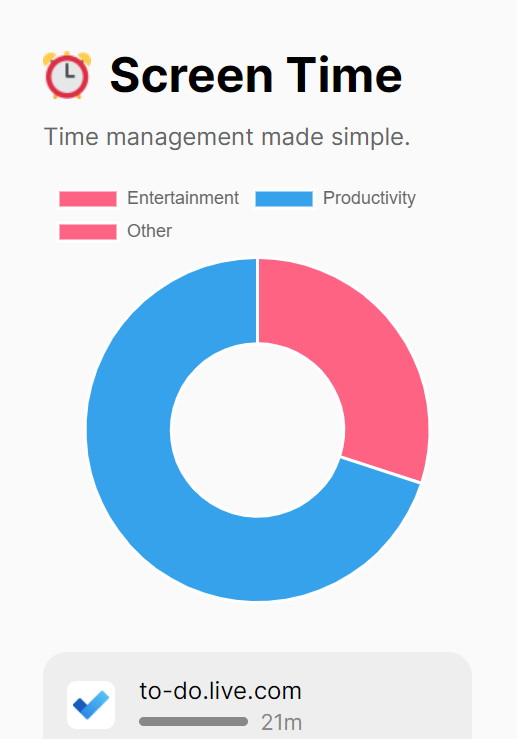

# Screen Time

A Chrome extension that tracks your screen time. Time management made simple!  
If you want to use this extension for yourself, note that **website content is sent to an external API** that classifies what type of website you are visiting (entertainment, productivity, or something else). The API is hosted on Replit and is [open source](https://github.com/nathan-pham/website-classifier-api) - the model itself is actually within this repository in the `screen-time-classifier` folder.

## Screenshots

